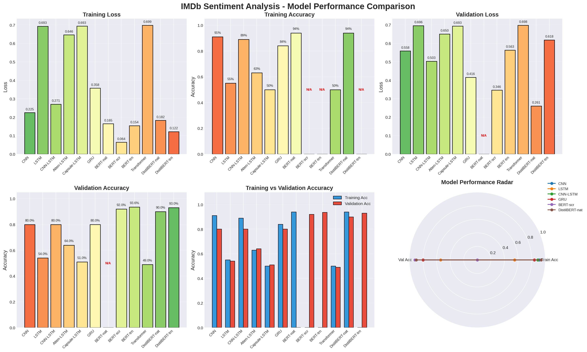

# nlp-llm-learning
学习记录（learning record)

## 情绪分析结果

| Model              | Train Loss | Train Acc | Val Loss | Val Acc |
| ------------------ | ---------- | --------- | -------- | ------- |
| CNN                | 0.2246     | 91.00%    | 0.5581   | 80.00%  |
| LSTM               | 0.6929     | 55.00%    | 0.6955   | 54.00%  |
| CNN-LSTM           | 0.2707     | 89.00%    | 0.5027   | 80.00%  |
| Atten-LSTM         | 0.6462     | 63.00%    | 0.6502   | 64.00%  |
| Capsule-LSTM       | 0.6934     | 50.00%    | 0.6930   | 51.00%  |
| GRU                | 0.3576     | 84.00%    | 0.4159   | 80.00%  |
| BERT-native        | 0.1647     | 94.00%    | N/A      | N/A     |
| BERT-scratch       | 0.0642     | N/A       | 0.3462   | 92.00%  |
| BERT-trainer       | 0.1544     | N/A       | 0.5632   | 93.58%  |
| Transformer        | 0.6986     | 50.00%    | 0.6979   | 49.00%  |
| DistilBERT-native  | 0.1825     | 94.00%    | 0.2606   | 90.00%  |
| DistilBERT-trainer | 0.1220     | N/A       | 0.6183   | 93.02%  |

如图所示：

